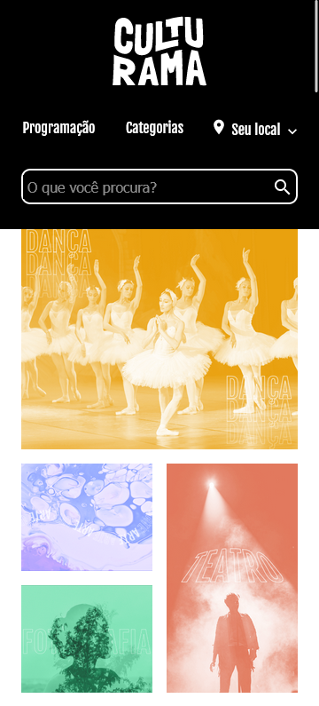
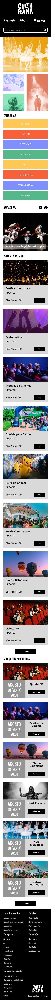
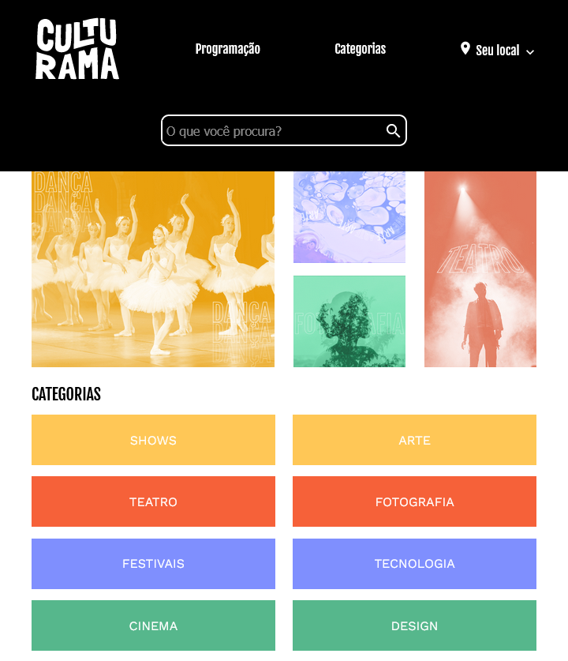
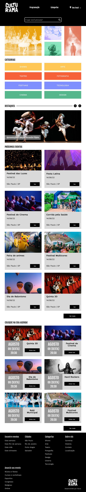
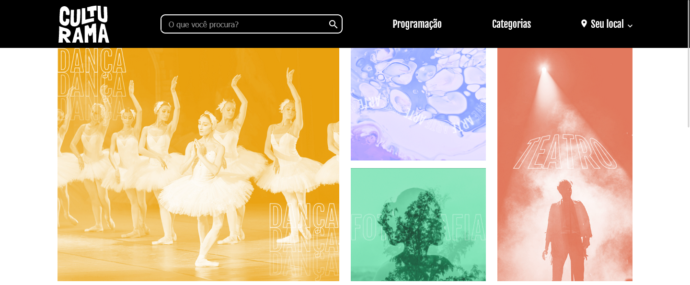

# README.md

## 📌 Introdução

Layout do site Culturama, desenvolvido através do curso de front-end pela plataforma Alura, utlizando diversos conceitos e boas práticas com grid e flexbox.

## 🔍 Sobre a interface

## Construção da interface com HTML e CSS

A interface foi construída utilizando as tecnologias HTML e CSS. O layout foi criado com base em diversos conceitos de grid e flexbox, entendendo e diferenciando cada uma de suas implementações práticas, por exemplo:

Flexbox:

- Organizar elementos com display: flex.
- Entender o eixo padrão dos itens flex.
- Organizar grupos de itens na horizontal e vertical.
- Diferenciar flex-item e flex-container.
- Alterar eixos com flex-direction.
- Organizar conjuntos de itens em um container com flex-grow.
- Unir propriedades do flexbox em conjunto de media query para obter o resultado de layouts responsivos.
- Utilizar a propriedade align-self para alinhar itens individualmente no flexbox.

Grid:

- Trazer o contexto do grid para um container por meio do display: grid.
- Realizar a contagem das linhas do grid horizontais e verticais.
- Definir o posicionamento inicial e final de um grid item em relação às linhas e colunas do layout.
- Criar linhas e colunas em um Layout, calculando as alturas e larguras.
- Posicionar itens por meio da criação de um template com áreas do Grid.
- Utilizar a unidade de medida fr.
- Utilizar a função do CSS repeat().
- Utilizar a propriedade align-self para alinhar itens individualmente no grid.

## Responsividade

O projeto foi pautado sob a premissa mobile first, e posteriormente adaptado por meio de media queries para as resoluções de tablet (720px) e desktop (1440px):

## 📲 Midia

### Interface em 360px, 720px, 1440px, respectivamente:

<h2>360px</h2>

    
Versão completa

    

<h2>720px</h2>

    
Versão completa

    

<h2>1440px</h2>

    
Versão completa

    

## 🚀 Conclusão e próximos passos

Este projeto foi uma ótima oportunidade para desenvolver meus conhecimentos em HTML e CSS, especialmente em relação aos conceitos e boas práticas do Grid e Flexbox.

É importante termos consciência dos momentos em que o uso de grid ou flexbox é benéfico. Dessa forma, como programadores, fortalecemos nossas habilidades ao implementar e manter códigos responsivos e acessíveis em projetos exigentes.

Agradeço à plataforma Alura por disponibilizar um curso tão completo e prático sobre front-end, e espero continuar aprendendo com a comunidade de desenvolvedores. Caso queira saber mais sobre mim ou entrar em contato, fique à vontade para acessar meu perfil no LinkedIn: https://www.linkedin.com/in/rubens-fs/.